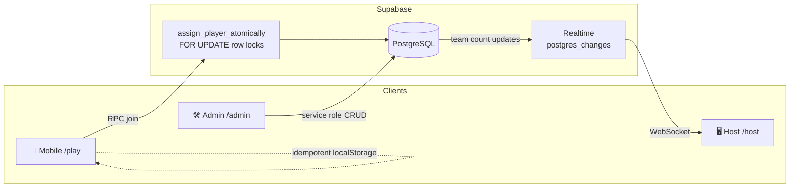

# Innovator Startup Matchmaker

[](.github/workflows/ci.yml)
[](https://nextjs.org/)
[](https://www.typescriptlang.org/)
[](https://supabase.com/)
[](https://tailwindcss.com/)
[](https://vitest.dev/)
[](https://www.framer.com/motion/)

Production-grade web platform for an **Innovation Summer School**: every morning mentors activate a daily session with 8 teams × **1 target domain + 3 keywords**; up to **40 students** scan a QR code and are **atomically seated** without race conditions; a hall TV stays in sync over **Supabase Realtime**.

| Surface | Route | Audience |
|---------|-------|----------|
| Landing | `/` | Everyone |
| Participant | `/play` | Students (mobile) |
| Host board | `/host` | Hall projector / TV |
| Admin | `/admin` | Mentors |

---

## Architecture



**Data model (simplified):** `daily_sessions` → `teams` (8 per session, `current_count` / `max_capacity`) → `player_assignments` (unique per `session_id` + `player_uid`).

---

## Key Engineering Highlights

- **PostgreSQL atomic row locking** — `assign_player_atomically` locks all session team rows with `SELECT … FOR UPDATE` (stable `team_number` order to avoid deadlocks), then seats the player on a **random open team** (`ORDER BY RANDOM()`), increments capacity, and inserts the assignment in one transaction. Designed for **40 concurrent QR scans** with zero oversell.
- **Idempotent re-joins** — unique `(session_id, player_uid)` plus early existence check; twin requests that race the insert are reconciled via `unique_violation` handling.
- **Sub-100ms hall sync** — Host view subscribes to Realtime on `teams` / `player_assignments` so occupancy and join pulses update as students land.
- **Daily word management** — Admin can auto-fill 8 teams with a Georgian **sector/domain** + **3 keywords**, or edit them manually, then activate a session for the morning.
- **Client resilience** — Persistent anonymous `player_uid` and cached assignment / idea notes in `localStorage` keep refresh/rescan UX smooth without double-consuming seats.

---

## Tech Stack

- **Next.js 16** (App Router) + **React 19** + **TypeScript**
- **Supabase** (PostgreSQL, RPC, Realtime, RLS + service-role admin)
- **Tailwind CSS 4** · **Framer Motion** · **Lucide** · **qrcode.react**
- **Vitest** + **GitHub Actions** CI (typecheck, lint, test, build)

---

## Local Development Setup

### 1. Clone & install

```bash
git clone <your-repo-url>
cd innovator-startup-matchmaker
npm install
```

### 2. Environment variables

Copy `.env.example` → `.env.local`:

```bash
NEXT_PUBLIC_SUPABASE_URL=https://YOUR_PROJECT_REF.supabase.co
NEXT_PUBLIC_SUPABASE_ANON_KEY=your_anon_public_key_here
SUPABASE_SERVICE_ROLE_KEY=your_service_role_secret_key_here
```

- Anon key: browser + Realtime + `assign_player_atomically`
- Service role: **server-only** admin mutations (never expose to the client)

### 3. Database migrations

In the Supabase SQL editor (or CLI), apply in order:

1. `supabase/migrations/001_initial_schema.sql` — tables, indexes, atomic RPC, seed Day 1
2. `supabase/migrations/002_realtime_publication.sql` — Realtime publication + `REPLICA IDENTITY FULL`

Confirm Realtime is enabled for `teams`, `player_assignments`, and `daily_sessions` in the Supabase dashboard if needed.

### 4. Run the app

```bash
npm run dev
```

Open [http://localhost:3000](http://localhost:3000).

| Command | Purpose |
|---------|---------|
| `npm run dev` | Next.js dev server |
| `npm run build` / `npm start` | Production build & serve |
| `npm run lint` | ESLint |
| `npx tsc --noEmit` | Strict typecheck |
| `npm test` | Vitest unit tests |

### 5. Typical morning flow

1. Mentors open `/admin` → create/activate a session (or auto-fill Georgian words).
2. Project `/host` on the hall screen (QR + live seats + timers).
3. Students scan QR → `/play` → atomic team assignment + idea scratchpad.

---

## Project Structure (high level)

```
src/
  app/           # /  /play  /host  /admin
  components/    # admin · host · player UI
  hooks/         # useRealtimeHostSession
  lib/           # supabase clients, actions, presets, player-storage
  types/         # domain TypeScript interfaces
supabase/
  migrations/    # schema + realtime
tests/           # Vitest unit tests
.github/workflows/ci.yml
```

---

## License

Private / Innovation Summer School use unless otherwise specified.
